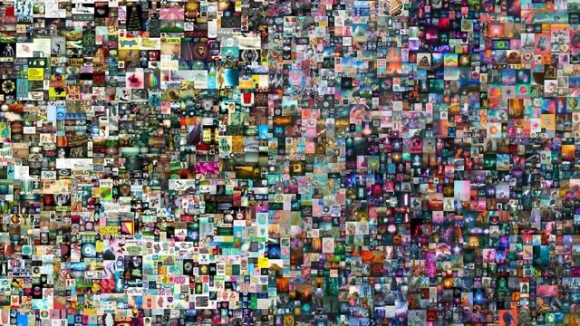
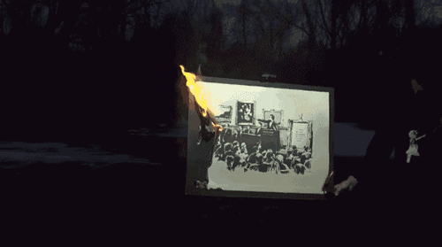
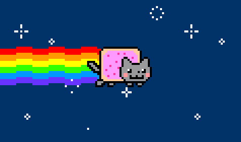
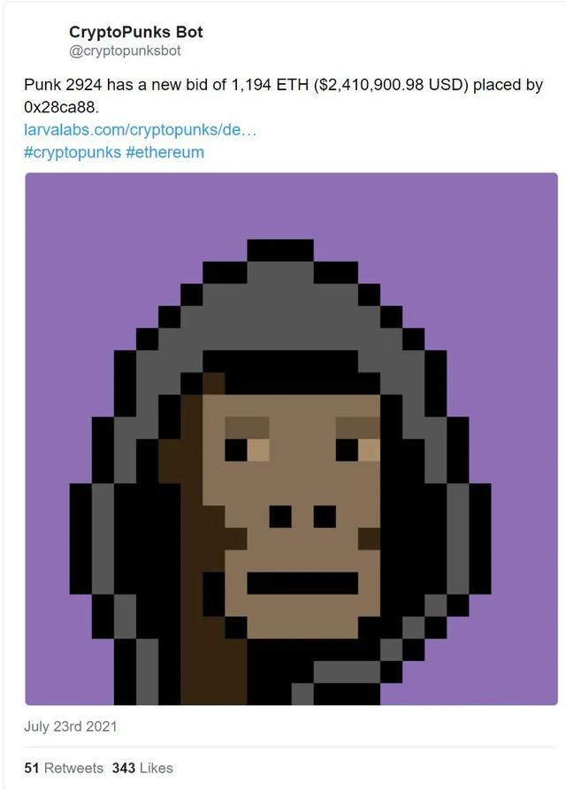

改改改改改改改改改改改改改改改改改改改改改改改改改改改改改改改改改改改改改改改改改改改改

2021年3月，数字视觉艺术家Beeple的一套NFT艺术品备受关注。从2007年开始，Beeple每天都创作一件艺术品，最后他将五千幅作品拼接成一张图片，并将其命名为《Everydays：The First 5000 Days》，并在佳士得拍卖行上线。

艺术家Beeple的NFT作品《Everydays：The First 5000 Days》，图源网络

3月11日，一个名叫“MetaKovan”的卖家以6934.8万美元的价格拍下了这幅作品。这个数字出乎所有人的预料，NFT艺术，也开始光速出圈。

同样在2021年3月，另一个新闻也让人们看到了NFT艺术的商业潜力。著名街头艺术家Banksy的作品《Mornos》（《白痴》）被以9.5万美元的价格买下，随后购买者直播烧毁了画作，并将其NFT版本挂上NFT交易平台Opensea。最终，《Mornos》的NFT版本被以4倍的价格售出，约合人民币247万。

直播画面里，蒙面的持有者点燃了《Mornos》。画作熊熊燃烧，《Mornos》完成了从实体艺术品到NFT艺术品的转变，火光似乎正向全世界预告着，NFT艺术的时代正式来临。

烧毁《Mornos》直播画面

有趣的是，《Mornos》本就是Banksy为讽刺高价艺术品而创作的，画作展现了一个人满为患的拍卖场，拍卖师正介绍着一幅画作，而他身旁的一个相框里写着“我真不敢相信你们这群白痴买了这个”。

烧画者，也是《Mornos》实体作品的持有者——区块链公司Injective Protocol将烧画行为定义为“一种艺术表达”。在NFT艺术领域，NFT代币常常与数字艺术、行为艺术紧密结合，从而衍生出一种新的艺术形式——加密艺术。

加密艺术的特点非常明晰，区块链技术决定的“去中心化”，超越国别地理的广泛交易，以及各种各样的艺术形式。

如果要用例子去解释这些特点，可以这样畅想：你拥有的NFT艺术藏品可以以任何形式在数字世界存在，一条短视频、一件虚拟时装、一条代码、一件游戏装备、一张表情包，或是NBA球星的生涯经典瞬间，都可以被你收入囊中。

价值59 万美元的NFT《Nyan Cat（彩虹猫）》GIF，图源艺术星空

价值59 万美元的NFT《Nyan Cat（彩虹猫）》GIF，图源艺术星空

NFT艺术品的交易门槛并不高，即使你并不了解艺术领域，你仍旧可以进行收藏，艺术家也不用通过拍卖行、艺术品市场发行作品，通过区块链，每个人都可以参与到艺术市场中。

NFT的多种可能性让艺术领域为之震动。前面提到的CryptoPunks像素头像是当前炙手可热的NFT之一，在当前市场已有的一万个像素头像中，价格最高的达到了4200ETH，相当于757万美元，而外星人、猿人形象的像素头像更是高价难求，是NFT中的奢侈品。

昂贵的“猿人”CryptoPunk，图源网络

越来越多的艺术家也开始试水NFT领域。他们将自己的艺术作品进行铸币，使其成为一件NFT艺术品，将其发行于一级市场，如果有人买下了该NFT，很有可能还会进入二级市场的各种平台，再一次进行流通，而在每次交易中，艺术家都能凭此获利。

目前海外最热门的几个NFT交易平台基本都基于公链以太坊，如Opensea、Rarible、Foudation，这些平台有的准入门槛较低，有的则实行邀请制，但“铸币”都需要缴纳至少50美元的费用，收藏者们也可以在这些平台上进行NFT交易，但同样会收取较高的手续费。
