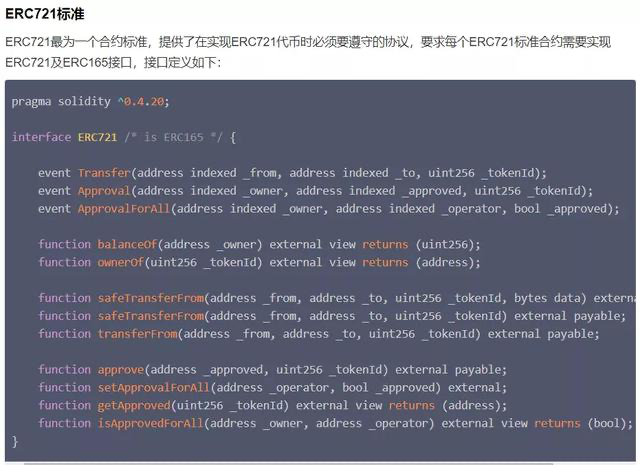

NFT的全称是Non-fungible token，是一种基于以太坊区块链的“非同质化代币”。

与比特币、以太币等虚拟货币一样，NFT同样依靠区块链进行交易。但NFT代币的最大特点在于其唯一性，“非同质化”，每一块NFT都独一无二，不可互换，人们可以将特殊资产绑定在NFT上，其可以让许多物品成为一种数字化抽象物，变成所有者的“数字资产”。

制作NFT的编程标准“ERC721协议” 图源Tiny熊《剖析非同质化代币ERC721》

水电费水电费
如果说比特币、以太币等同质化代币可以被比作钞票，NFT更像是一件艺术品的原件。凭借这种特性，NFT在艺术领域得到了广泛应用，诸多数字艺术品开始与NFT绑定。
