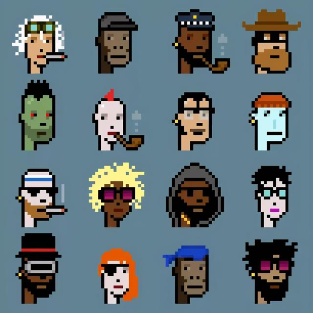
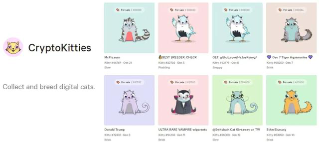

彼时，Larva Labs公司开发了一款像素头像生成器，生成了约1万个各式各样的像素头像，带着“朋克”精神的期许，这一头像系列被命名为CryptoPunks，意为“加密朋克”。2017年正值以太坊火热发展之际，Larva Labs将CryptoPunks头像挂上区块链，并赋予其流转收藏的价值。

CryptoPunks系列像素头像，图源网络

这为NFT的诞生提供了契机。同年，受CryptoPunks影响，一家名为Crypto Cats的公司推出一款名为“密码猫”（CryptocKitties）的游戏，游戏里玩家可以通过一串代码创造出一只“密码猫”数字形象，并且每一只猫都独一无二，这些密码猫们的所有权都被存储在以太坊上。

“密码猫”被认为是NFT代币的滥觞。2017年底，以太坊ERC 721协议（非同质化代币的编程标准）诞生，NFT也随之出现。2021年，经过近四年的发展，在艺术领域，NFT终于迎来了“爆发”。

密码猫CryptoKitties，图源网络
